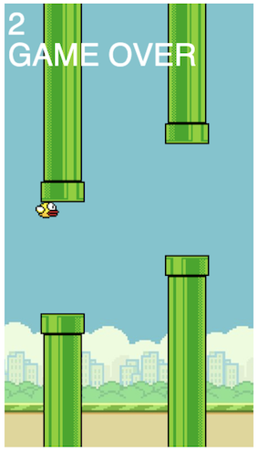

# 🐥 Flappy Bird Clone

A browser-based Flappy Bird game built using JavaScript and HTML5 Canvas.

## Gameplay 

Control a pixel bird to fly between pipes without hitting them. Tap the **Spacebar**, **Arrow Up**, or **X** key to make the bird jump. The game ends when the bird hits a pipe or falls below the screen.

## Demo

To run the game locally:

1. Clone this repository:
    ```bash
    git clone https://github.com/clairescodes/flappybird.git
    cd flappybird
    ```

2. Open `index.html` in your browser.

Example gameplay



